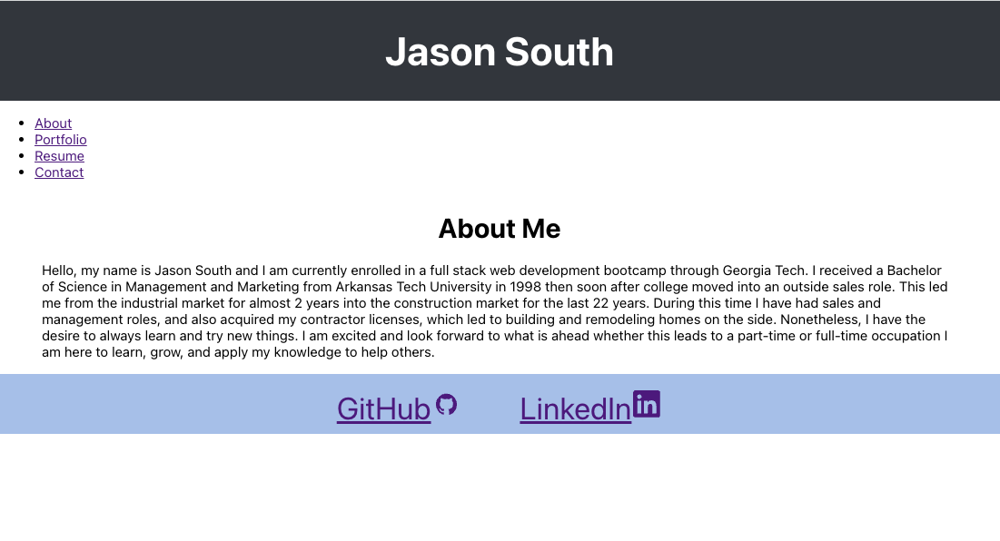

# React Portfolio

## Description
I recreated my resume showcasing some of the projects I have created in last few months by using React. 

Deployed Link: <a href="" title="React_Portfolio">React Portfolio</a>
GitHub Link: 

## Table of Content
- [Usage Information](#usage)
- [License](#license)
- [Contributor](#contributor)
- [Contact Information](#contact)

## Usage

Enter "npm start" from the CLI and press enter.

## License

[ISC](https://choosealicense.com/licenses/isc/) license

## Contributor

Jason South

## Contact
Jason South  
GitHub username: jsouth75  
Email: jason.south@me.com
